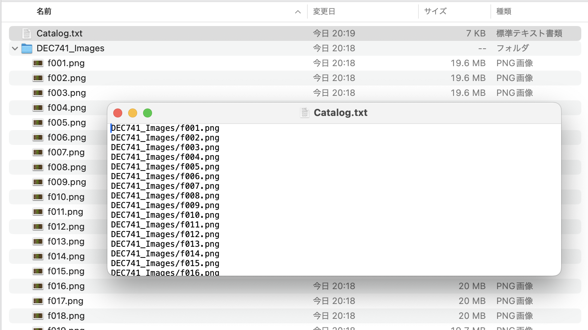

# TrainScanner関連

[TrainScanner](https://github.com/vitroid/TrainScanner)は、通過していく列車の側面をビデオカメラで撮影して、その動画データからスリットスキャン写真を合成するための便利なツールです。


- [TrainScanner関連](#trainscanner関連)
  - [使い方について](#使い方について)
  - [撮影した動画データの補助ツール(tsutil)](#撮影した動画データの補助ツールtsutil)
  - [連続した画像データの読み込みについて](#連続した画像データの読み込みについて)

## 使い方について

ビデオカメラで撮影した動画データからスリットスキャン写真を合成する使い方については、[TrainScanner](https://github.com/vitroid/TrainScanner)のREADMEをご覧ください。

## 撮影した動画データの補助ツール([tsutil](https://github.com/yamakox/tsutil))

カメラで撮影した動画データには以下の課題があったため、[`tsutil - TrainScanner用の動画データを事前処理するためのツール`](https://github.com/yamakox/tsutil)を作りました。

- 列車の通過前・通過後の撮影時間の分だけ動画データのファイルサイズが大きくなり、ストレージを無駄に消費してしまう。
- パソコンに読み込ませると、カメラと比べて輝度や色合いが少し変わってしまうことがある。(私が使っているα7RIIIやα7SIIIではそうなる感じ)
- ホームでの手持ち撮影では、手振れによる画像のズレや水平・垂直出しに失敗して合成写真がガタガタになってしまうことがある。

[tsutil](https://github.com/yamakox/tsutil)を使うと、動画データから連続した画像データを作ります。Photoshopなどの画像処理ソフトを使って画像データのノイズ低減・輝度・色補正などが可能になります。

また、以下のような動画データを生成する機能もあるので、SNSで写真を共有するのに便利です。


## 連続した画像データの読み込みについて

動画データの状態によっては、動画データを1フレームずつ画像ファイルに展開してPhotoshopなどで事前編集したい場合があります。(輝度や色調整、回転や台形補正、ブレ補正など)

動画から展開した画像ファイルは、そのままではTrainScannerに読み込ませることができませんので、連続した画像ファイルのカタログファイル(拡張子は`.txt`または`.lst`)を作成してTrainScannerに読み込ませるための改造を行っています。

なお、最新のTrainScanner(2025年6月現在)では、連続した画像ファイルの入ったフォルダ(ディレクトリ)をドラッグ&ドロップで開くことができるようになっています。



```bash
# 改造版TrainScannerのインストール方法。ターミナルからコマンド入力してください。
# PythonはHomebrewでインストールできます。(brew install python)
python3 -m venv venv
source venv/bin/activate
pip3 install git+https://github.com/yamakox/TrainScanner.git@image-catalog-file-0.13.2
```

カタログファイルには、連続した画像ファイルのパス名(画像ファイルの格納場所)を1行ずつ順番に記しておきます。

```bash
.
├── Catalog.txt
└── 連続画像データ
    ├── f001.png
    ├── f002.png
    ├── f003.png
    ├── f004.png
    :
```

例えば上記のように画像ファイルが格納されている場合、カタログファイルには以下のように画像ファイルのパス名を記しておきます。

```Catalog.txt
連続画像データ/f001.png
連続画像データ/f002.png
連続画像データ/f003.png
連続画像データ/f004.png
    :
```

ターミナルを使えば、以下のようにカタログファイルを作成することもできます。

```bash
ls -d 連続画像データ/*.png > Catalog.txt
```

出来上がったカタログファイルは改造版TrainScannerの「ムービーを開く」画面から選択することができます。
